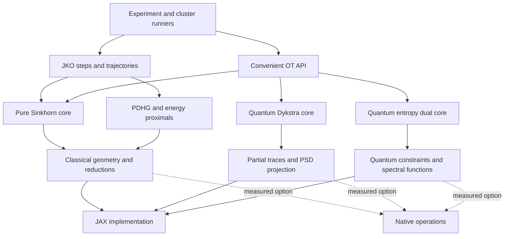

# EROT, gradient flows, and HPC architecture

License update (2026-09-21): the user confirmed Apache-2.0 for both QOTLib and numerical-gradient-flows. Earlier missing-license observations below describe the inspected trees, not an outstanding permission question. Preserve attribution and applicable notices when adapting source.

Status: proposed specification for review; implementation has not started.

This specification records the direction agreed in the discussion on 2026-09-21. The target includes both large individual solves and many independent experiments. The latest hardware direction is NVIDIA Hopper or newer, with configurable resources for an openly shared library; it supersedes the earlier fixed GPU/CPU allocation. The user selected `ubraket513/YACHT` as the engineering reference, added QOTLib as an algorithm source to assess, and requested repository cleanup and restructuring before numerical integration.

Read the [delivery roadmap](../plans/2026-09-21-erot-flows-hpc-roadmap.md) for dependencies, the [YACHT adoption record](2026-09-21-yacht-conventions.md) for engineering conventions, the [QOTLib assessment](2026-09-21-qotlib-adoption.md) for algorithm decisions, and the [Stage 0 cleanup plan](../plans/2026-09-21-erot-stage-0-cleanup.md) for the first executable work package. The [Stage 1 baseline plan](../plans/2026-09-21-erot-stage-1-baselines.md) follows the structural cleanup.

## 1. Scope and constraints

- Merge reusable numerical-gradient-flows functionality into the EROT distribution; keep SDPLab as the independent second repository.
- Do not modify or relocate `SDP-Simulation/` as part of this plan.
- Target NVIDIA Hopper or newer for GPU optimization; retain a CPU installation and numerical reference path. Publish tested architecture/runtime combinations rather than promising support for every future GPU.
- Make GPU count, CPUs per task, memory, node count, device links, and scheduler settings configurable. The earlier one-/two-GPU, 16-core allocation is an example profile, not a library limit or default entitlement.
- Preserve the existing `erot.solve`, `SolverConfig`, CLI, and dense result behavior during the additive migration.
- Adopt YACHT's `src/` package layout in Stage 0, preserving the `erot` import name and validating installed artifacts outside the source checkout.
- Retain Python >=3.11. Initially retain the declared JAX >=0.4.30 and NumPy >=1.26 floors; do not imply that these floors support future distributed or native extensions.
- Before adding version-sensitive sharding or FFI code, establish a tested JAX/jaxlib/CUDA combination and update the supported floor and environment lock together.
- Keep JAX and NumPy as the mandatory numerical dependencies. Plotting, experiment optimization, independent reference solvers, and native extensions remain optional.
- Support float64/complex128 reference computations and separately validated float32/complex64 execution; do not silently reduce precision.
- Use the same mathematical objective and accuracy requirements for every performance comparison.
- Keep original source provenance and attribution. Preserve the nested gradient-flow and QOTLib histories and local changes; establish reuse rights before importing their source into a public distribution.
- Adapt selected QOT algorithms to EROT's contracts and style. Do not vendor QOTLib's entire backend framework, experimental scripts, dependency list, or generic SDP drivers.

Exact GPU variants and usable memory, peer links, interconnect, node count, host RAM, CPU topology, and largest required problems remain unspecified. Stage 1 records these per allocation. Stage 0 needs a CPU environment and before/after compatibility checks; it does not wait for a cluster benchmark campaign. Hardware-specific claims depend on measured evidence.

## 2. Evidence from the current checkout

The scan used Serena symbol overviews, symbol bodies, and references. These are observations, not benchmark results.

| Component | Existing implementation | Consequence |
|---|---|---|
| `erot/classical.py:shannon_sinkhorn` | Dense multi-marginal log-domain Sinkhorn; compiled loop; final potentials discarded | Extract reusable state and preserve multi-marginal behavior |
| `erot/api.py:solve` | Host-facing validation, single-device selection, blocking, Python diagnostic scalars | Keep as a convenience wrapper around a separate device computation |
| `erot/validation.py:validate_classical` | Converts through NumPy before device placement | Do not run this path inside a compiled flow or on a global distributed array |
| `numerical-gradient-flows/src/jko_lab/sinkhorn_jko.py` | Separate Sinkhorn, dual warm starts, nested gradient-based JKO, `scan` trajectory | Consolidate the transport solve while preserving the useful warm-start logic |
| `numerical-gradient-flows/src/jko_lab/pdhg_jko.py` | Unregularized discrete JKO with a dense coupling, two driver paths | Consolidate PDHG behavior and validate its constraints independently |
| `erot/quantum.py` | Dense quadratic Dykstra, three correction matrices, full `eigh` PSD projection | Quantum memory and distributed eigensolver feasibility need a separate workstream |
| `benchmarks/benchmark_solvers.py` | One first call and one warm call; aggregate memory; basic timing comparison | Extend measurement and comparability before selecting a native backend |
| Gradient-flow packaging | Imports Flax/Optax although they are absent from declared runtime requirements | Remove unnecessary runtime dependencies during migration; isolate optional historical reproduction |
| QOTLib `regularization/` and `solvers/_optax.py` | Spectral entropy/quadratic dual objectives and an Optax driver | Candidate entropy-QOT capability; audit normalization, complex derivatives, state, and stopping rules |
| QOTLib block solvers and Lanczos | Structured block PDHG, chordal preprocessing, matrix-vector Lanczos | Separate experimental candidates; not drop-in dense PSD projections or proven distributed solvers |

At planning time EROT HEAD is `424c4ed`, the clean gradient-flow repository HEAD is `0c6f5b5`, and the clean QOTLib checkout at `QOTLib/QOTLib` is `bd534c61aeae082892b9b2421db153beb8e5c804`. The parent sees `.serena/`, `SDP-Simulation/`, `numerical-gradient-flows/`, and `QOTLib/` as untracked local directories. No license file was found in either imported-source candidate's tracked tree. Record provenance and resolve source reuse before copying; EROT's own MIT license does not answer this question. Never stage nested repositories incidentally.

The current shell's Python interpreter has no installed JAX, NumPy, or test dependencies. No numerical tests or performance experiments have been executed for this specification.

## 3. Mathematical contract

### Classical transport

For equal-mass vectors `a`, `b`, define Shannon transport by

\[
T_\varepsilon(a,b)=\min_{\pi\ge0,\ \pi\mathbf1=a,\ \pi^T\mathbf1=b}
\langle C,\pi\rangle+\varepsilon\sum_{ij}\pi_{ij}(\log\pi_{ij}-1).
\]

Use the continuous convention `0 log 0 = 0`. Ordinary OT continues to accept equal positive total mass other than one. JKO initially requires unit-mass vectors. The regularizer is coupling entropy, not KL relative to the product of the marginals; that distinction affects marginal derivatives.

Store Sinkhorn potentials in cost units: `pi = exp((f[:, None] + g[None, :] - C) / epsilon)` in the two-marginal case. On strictly positive support, `f` is the derivative of the optimized value with respect to `a`, up to the additive gauge on a fixed-mass simplex. Test directional derivatives along zero-sum directions. With zero marginals, restrict derivative assertions to positive support rather than treating infinite potentials as an ordinary differentiable boundary.

Use a documented gauge, such as `dot(a, f) / sum(a) = 0` on positive support, compensating `g` oppositely. Skip zero-weight terms explicitly so `0 * -infinity` does not create NaNs. For multiple marginals compensate offsets so their sum remains zero. Warm starts across different epsilon values preserve cost-unit potentials and reconstruct their log scalings for the new epsilon.

Classical quadratic OT retains `dot(C, pi) + epsilon * ||pi||_F^2 / 2`. Changing a cost factor or entropy convention is a scientific behavior change, with a regression test and migration note.

### JKO

For `C_ij = distance(x_i, x_j)^2`, define

\[
\rho^{k+1}\in\arg\min_{\rho\in\Delta}
F(\rho)+\frac{T_\varepsilon(\rho,\rho^k)}{2\,\Delta t}.
\]

Name parameters `time_step`, `epsilon`, `primal_step`, and `dual_step` at the new boundary so time integration and PDHG step sizes cannot be confused.

The PDHG backend initially solves the unregularized version, equivalently `time_step * F(rho) + 0.5 * dot(C, pi)`. The entropic backend and the unregularized backend are labeled distinctly. An epsilon-to-zero study is not an equality test at finite epsilon.

The existing Sinkhorn flow uses `2*f`; the existing PDHG code uses `0.5*C`. Audit the former with an independent value derivative before migrating it. Do not declare the discrepancy fixed from code inspection alone.

Represent finite-volume data as cell masses. If a user supplies density samples and cell volumes `w_i`, convert `mass_i = density_i * w_i`; integrated entropy then uses `sum_i mass_i * (log(mass_i / w_i) - 1)`. Record boundary conditions and quadrature in each experiment. No implicit periodic convolution or hidden renormalization may change the modeled problem.

JKO diagnostics include mass error, positivity, objective, both PDHG marginal constraints where applicable, and an optimality/stationarity criterion. A small marginal residual alone does not certify a JKO minimizer. An unsuccessful inner solve does not silently advance the physical time: default to an explicit failed-step result; an opt-in retry policy may increase work without changing the objective.

Energy monotonicity tests must match the formulation. Unregularized exact JKO and finite-epsilon JKO do not inherit every identical energy property. Study epsilon, spatial resolution, time step, and inner tolerance separately.

### Quantum transport

Preserve the current quadratic objective `Re trace(C Gamma) + epsilon * ||Gamma||_F^2 / 2`, Hermiticity, PSD constraint, and prescribed partial traces. A separately named entropy-QOT solver may add `epsilon * Tr[Gamma(log Gamma - I)]`, with its precise domain, trace/mass normalization, conjugate, and diagnostics documented. Neither static solver establishes a quantum Wasserstein gradient flow.

QOTLib's `EntropyReg` sums exponentials in its conjugate; `EntropyRegLog` uses log-sum-exp. Their trace constraints and objective constants must be reconciled before adoption. Do not normalize every recovered primal to trace one regardless of the selected regularizer or marginals. Preserve EROT's unequal subsystem dimensions; QOTLib's current `QOTProblem(d, N)` assumes equal local dimensions. See the adoption record for the independent reference and adjoint tests.

A factorized or low-rank coupling is a separate approximation or optimization formulation. It cannot silently replace the dense convex reference. Dykstra correction state can resume the same problem; reusing it after changing costs, marginals, or epsilon requires a mathematically justified reinitialization.

## 4. Component boundaries



Stage 0 first inventories tracked inputs, generated outputs, local repositories, and existing compatibility checks; then moves the current package to `src/erot/`. Keep `erot.classical` and `erot.quantum` import compatibility during extraction. Introduce small `src/erot/solvers/`, `src/erot/geometry/`, `src/erot/flows/`, and `src/erot/runtime/` modules only as their features arrive. Separate layout, formatting, and numerical changes into reviewable diffs. Preserve generated historical artifacts with a manifest before removing them from active demo/test paths.

The intended repository layout is:

```text
src/erot/             Python library and CLI
tests/unit/          Local behavior, validation, and algebraic invariants
tests/reference/     Independent small numerical oracles
tests/integration/   Installed CLI workflows and restart behavior
tests/gpu/           GPU precision and placement
tests/distributed/   Collective correctness and shard equivalence
tests/data/          Small deterministic fixtures only
archive/             Preserved historical artifacts; excluded from distributions
benchmarks/          Measurement tools and case definitions
experiments/         Reproducible scientific studies
hpc/                 Cluster profiles and launch templates
docs/                User, mathematical, contributor, and design documentation
examples/            Small runnable demonstrations
native/              Optional compiled implementation, created only if selected
```

Retain setuptools and authoritative metadata in `pyproject.toml`. Build both wheel and sdist, install each in a clean environment, and run public API and CLI smoke tests from outside the repository. Do not make the base wheel require a C++/Fortran compiler or CUDA toolkit. Native distribution is conditional and must use correct platform/runtime compatibility metadata; no generic wheel containing an unqualified GPU binary.

Follow YACHT's configured 88-column formatting, four spaces, double quotes, and documented functions. For EROT target Python 3.11 in tooling, add explicit imports, typed public interfaces, and numerical docstrings documenting shape, dtype, mass convention, objective normalization, and supported transformations. Enforce Ruff formatting and correctness/import checks in CI; record any narrow scientific naming exceptions explicitly.

CI separates formatting/lint, CPU unit/reference tests, installed workflow tests, wheel/sdist checks, and opt-in GPU/distributed runs on actual hardware. Collect coverage as a diagnostic and require tests for changed behavior; line coverage alone cannot certify scientific accuracy or HPC readiness. Keep tests independent using temporary output directories and argument-list subprocess calls. External service credentials and cluster access are not prerequisites for the ordinary CPU suite.

The host layer validates external data, initializes precision and placement, translates exceptions/status, times calls, and writes results. The device layer accepts arrays and explicit PyTree state, performs no file I/O or implicit device selection, and returns arrays without Python scalar conversion or synchronization. Numerical failures produce device status codes that the host layer interprets.

The device contract distinguishes three concepts:

1. Warm-start state for a new related problem, with documented compatibility checks.
2. Complete resume state for exactly the same interrupted problem.
3. Result diagnostics and an optional plan representation.

Sinkhorn returns potentials and convergence information. PDHG returns its primal/dual iterate state. Quantum Dykstra returns coupling and correction state when resume is requested. Iteration counts distinguish work in the current solve from cumulative work in a trajectory.

Keep the existing public dense `SolveResult` behavior. A new core result can represent transport implicitly, exposing block evaluation and transport application. Dense materialization is an explicit outer operation. Merely omitting a returned coupling is not evidence that the iteration avoided allocating one.

Geometry supports dense costs first, then point-cloud costs computed in blocks. Grid/separable geometry is added only with explicit metric and boundary semantics. Quantum operators remain distinct from classical geometry.

## 5. Hardware and execution

### Independent experiments

Use one process per allocated GPU as the initial scheduling unit. Derive the worker count and CPU budget from the allocation or explicit configuration, validate that they fit, and assign disjoint devices. A two-GPU/16-core profile could use two eight-core workers; it is an example, not a hard-coded maximum. Account for numerical-library threads and data-loader workers within each allocation; measure affinity and oversubscription rather than assuming one environment variable controls every JAX thread.

Batch small, same-shape problems only if throughput and memory measurements justify it. Do not put unrelated experiments into a collective distributed solve. Group comparable iteration lengths to avoid waste when a batched convergence loop waits for its slowest member.

Each run has a configuration digest, seed, source revision, unique output path, and retry/resume identity. Use rank-local data generation/loading and resumable chunked trajectories. Separate experiment throughput from isolated solve latency.

### A single problem on two GPUs

First validate one controller using two local devices. Then validate a two-process, one-device-per-process launch to exercise the eventual multi-node path. Initialize distributed JAX before any device access in multi-process mode, and preserve the same collective order on every participant. [JAX multi-process guide](https://docs.jax.dev/en/latest/multi_process.html).

Start classical Sinkhorn with row-block ownership, local cost generation, and replicated target potentials where size permits. Row updates reduce over local complete target blocks. Column updates combine partial log-sum-exp values with globally stable max/sum reductions. Padding masks represent excluded costs as negative infinity in log reductions and correctly handle all-masked support. Document the communication per iteration; never gather the entire coupling to compute a residual.

For dense PDHG, partition coupling rows and reduce the column residual. This distributes the quadratic state; it does not remove it. A dynamic density/flux formulation is a later research work package.

Treat GPU architecture, form factor, usable memory, and interconnect as separate profile fields. Kernel selection uses actual device capabilities and dtype support, with a tested fallback. Do not assume an NVLink connection, pool GPU memory implicitly, or combine unlike GPU models in the first strong-scaling experiment. Two devices are an initial validation case; meshes and launch configuration must accept larger allocations without redesigning the public API.

### Public hardware support policy

Separate the portable CPU/JAX path, tested Hopper-or-newer GPU configurations, and optional architecture-specific kernels. Mark each combination as validated, experimental, or untested; record actual Python/JAX/jaxlib/CUDA/driver versions. An untested newer device is not automatically a supported fast path. Cluster profiles contain no account names, personal paths, fixed GPU model requests, or universal memory limits. Account/partition/QoS and resource requests come from site configuration. Capabilities are checked before launch; ordinary imports and CPU examples do not require CUDA or a scheduler.

### Multi-node extension

Promote the validated process model only after confirming the interconnect, process launch, compatible runtime, and distributed input/checkpoint behavior. Start with two nodes. Scalar diagnostic printing may be rank-zero-only; collective computations and distributed serialization must involve all required ranks. A passing virtual-device CPU test cannot certify GPU communication performance.

### Checkpoints

Save schema version, problem/configuration digest, simulated time and accepted step, solver/resume state, RNG state when used, dtype, geometry identity, source/runtime versions, and shard metadata. Publish a complete checkpoint manifest only after every required shard is durably written. Start by supporting restart on the same topology; reject incompatible restarts clearly. Resharded restart is a separately tested extension.

## 6. Language and native-library decision

JAX is the initial execution system and numerical reference implementation. It is not a promise that every maximal-performance backend will be JAX-only. XLA emits GPU code and invokes optimized native libraries, so Python syntax does not imply interpreted inner loops. [OpenXLA GPU architecture](https://openxla.org/xla/gpu_architecture).

| Choice | Use when | Cost to assess |
|---|---|---|
| JAX operations | The compiler produces adequate kernels and communication | Compilation, temporary arrays, unsupported distribution |
| Pallas Mosaic GPU | A custom kernel improves a measured Hopper-or-newer workload | Experimental API, architecture/dtype coverage, maintenance and JAX fallback |
| C++/CUDA operation via FFI | Fusion, memory access, reduction, or an external GPU library provides a measured advantage | Build/runtime support matrix, stream correctness, layouts, AD/batching/sharding rules |
| Existing Fortran numerical library through a C ABI | A proven CPU/distributed algorithm or institutional code provides capability or performance that is absent | ABI, threading, distribution, and host/device transfers |
| Larger native solver backend | Operation-level integration cannot control communication or memory adequately | Broader testing, duplicated orchestration, and explicitly limited differentiation support |

The Hopper-or-newer target makes Pallas Mosaic a relevant custom-kernel option. It currently supports Hopper and newer GPUs and remains experimental. Evaluate the actual operation, precision, architecture, and JAX version; retain regular JAX fallbacks rather than assuming a Hopper-specific kernel is optimal or compatible on every successor. CUDA/C++ remains an equally valid option when measurements or library integration favor it. [Pallas support](https://docs.jax.dev/en/latest/pallas/quickstart.html).

Fortran is a valid option, especially for existing scientific libraries, but no Fortran implementation is currently present in these numerical paths. A language rewrite alone supplies no performance evidence. Standard C interoperability makes library reuse possible without replacing the Python interface. [GNU Fortran interoperability](https://gcc.gnu.org/onlinedocs/gfortran/Interoperability-with-C.html).

Native calls are opaque to JAX: supported derivatives, batching, and partitioning must be supplied and tested. A host callback into a CPU routine inside every GPU iteration is not an acceptable default acceleration strategy. [JAX FFI](https://docs.jax.dev/en/latest/ffi.html).

### Early quantum feasibility decision

Stage 1 records the dense eigensolver's capabilities, memory requirements, and deployment options; the first hardware investigation measures `eigh` and a complete PSD projection on the target GPUs. If the required dense problem needs multiple GPUs, investigate a distributed library before committing to a JAX-only quantum design. QOTLib's single-extremal-eigenpair Lanczos routine does not replace the full positive spectral part required by dense Dykstra.

One candidate is cuSOLVERMp. Its eigensolver API includes real and complex types. Integration must budget its block-cyclic layout, column-major local storage, device and host workspace, communicator lifecycle, and redistribution from the surrounding solver. Use current initialization APIs; historical CAL examples are not the default for current NCCL-based releases. [cuSOLVERMp layout and requirements](https://docs.nvidia.com/cuda/cusolvermp/getting_started/index.html), [eigensolver API](https://docs.nvidia.com/cuda/cusolvermp/usage/functions.html).

Measure complete PSD projection and complete OT solves, including eigenvector reconstruction and redistribution. If mixing the native communicator with JAX execution is unsuitable, assess a native quantum solver behind the same host problem/result contract. Never run independent eigendecompositions on matrix shards and present that as a global PSD projection.

### Admission criteria

Use the existing benchmark policy as the starting point: investigate operations accounting for at least 30% of representative warm solve time; retain a performance extension if it gives at least 1.5x full-solve speedup or a 25% reduction in measured peak live memory at matched accuracy. A capability extension that enables a required previously infeasible problem is a separate valid justification, with its overhead documented.

Check Amdahl's law before implementation: `speedup = 1 / ((1-p) + p/k)`. Even eliminating a 30% operation entirely permits only about 1.43x full-solve speedup. The 30% threshold is a screening rule, not a promise that the 1.5x gate can be met.

Keep a verified fallback, no silent precision loss, and no unexplained greater-than-10% regression on the agreed representative workload set. Retain an architecture-specific extension only if its benefit justifies testing and maintaining that support matrix.

## 7. Measurement and correctness gates

Record problem identity, objective convention, geometry, shape, dtype, epsilon, time step, tolerances, iteration counts, outcome, hardware/topology, process/thread allocation, runtime versions, and source revision. Report first-call latency separately from steady-state solve time. Initial measurement uses one first call, one additional warm-up, and seven synchronized warm samples; report median, minimum, maximum, and the raw samples.

Measure both the host API and the device core when the latter exists. Label transfer/validation/checkpoint costs. Measure peak memory per isolated workload process where possible; distinguish active allocations from reserved allocator memory and record unavailable measurements as unavailable. Never fabricate peak usage from array-size estimates or reuse a cumulative peak as a per-case measurement.

Compare only matching scientific and hardware contracts. Nonconverged, nonfinite, or unvalidated results cannot win a performance comparison. Keep diagnostic fixed-iteration throughput separate from time to reach a specified solution accuracy.

Initial workload families: positive and zero-support classical Sinkhorn; rectangular and multi-marginal regression cases; quadratic classical OT; complex and rank-deficient quantum marginals; entropy and quadratic JKO; and independent experiment batches. Add entropy-QOT cases when that backend is implemented. Include CPU references and available Hopper-or-newer GPUs in both relevant precisions. GPU hardware that is not available is marked unmeasured, not passed.

For a compute-dominated problem that fits one GPU, use 1.3x speedup on two GPUs as an initial investigation target, not a universal release promise. Capacity is a distinct success criterion: a scientifically validated problem larger than the measured one-GPU capacity can justify two GPUs even without this speedup. For independent long experiments, investigate an initial target of 1.6x aggregate throughput on two GPUs. Generalize reporting to allocated device counts and choose published targets only after Stage 1 measurements.

Reverse-mode differentiation through a dynamic converged `while_loop` is not automatically available. Initial flows require differentiable energies, not an assertion of differentiability through every solve or trajectory. End-to-end derivatives are a separate work package with finite-difference checks, gauge handling, and implicit or bounded-iteration differentiation. [JAX loop contract](https://docs.jax.dev/en/latest/_autosummary/jax.lax.while_loop.html).

## 8. Review and release criteria

Each roadmap stage delivers a usable increment and applicable validation evidence. Stage 0 establishes structural compatibility before and after cleanup; Stage 1 adds the deeper numerical and hardware audits. Either can reveal existing failures; record them explicitly and assign correction before the affected backend is released. Do not erase original results or turn an expected failure into a passing numerical claim.

The initial integration milestone is one validated JKO workload running through EROT's shared Sinkhorn core with reusable potentials and a preserved standalone OT API. Quantum adoption is its own workstream: deliver a tested entropy-QOT baseline before promoting structured or low-rank variants. A flow release need not wait for experimental quantum research. The scalable release additionally requires blocked classical operation, restartable experiments, measured multi-GPU behavior on available target hardware, and a stated quantum capability boundary. Quantum native capability work can be brought forward when Stage 1 shows it is necessary.

Generalized KL-proximal JKO, dynamic PDHG transport, structured/low-rank quantum algorithms, and end-to-end differentiation are separately scoped research extensions. Generalized entropic JKO is supported by [Peyre's formulation](https://arxiv.org/abs/1502.06216), but its applicability still depends on the chosen functional and geometry.
